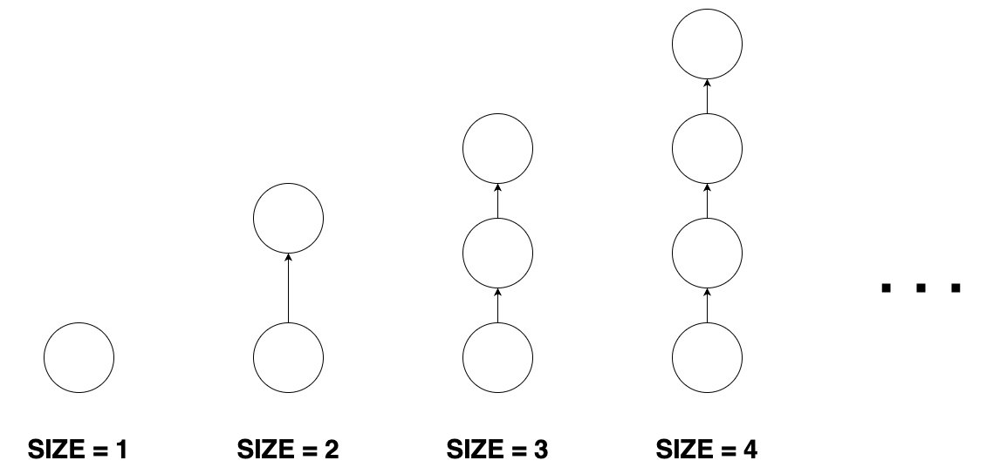

[문제 링크](https://school.programmers.co.kr/learn/courses/30/lessons/258711)
## 문제
도넛 모양 그래프, 막대 모양 그래프, 8자 모양 그래프들이 있습니다. 이 그래프들은 1개 이상의 정점과, 정점들을 연결하는 단방향 간선으로 이루어져 있습니다.

크기가 n인 도넛 모양 그래프는 n개의 정점과 n개의 간선이 있습니다. 도넛 모양 그래프의 아무 한 정점에서 출발해 이용한 적 없는 간선을 계속 따라가면 나머지 n-1개의 정점들을 한 번씩 방문한 뒤 원래 출발했던 정점으로 돌아오게 됩니다. 도넛 모양 그래프의 형태는 다음과 같습니다.

크기가 n인 막대 모양 그래프는 n개의 정점과 n-1개의 간선이 있습니다. 막대 모양 그래프는 임의의 한 정점에서 출발해 간선을 계속 따라가면 나머지 n-1개의 정점을 한 번씩 방문하게 되는 정점이 단 하나 존재합니다. 막대 모양 그래프의 형태는 다음과 같습니다.

크기가 n인 8자 모양 그래프는 2n+1개의 정점과 2n+2개의 간선이 있습니다. 8자 모양 그래프는 크기가 동일한 2개의 도넛 모양 그래프에서 정점을 하나씩 골라 결합시킨 형태의 그래프입니다. 8자 모양 그래프의 형태는 다음과 같습니다.

도넛 모양 그래프, 막대 모양 그래프, 8자 모양 그래프가 여러 개 있습니다. 이 그래프들과 무관한 정점을 하나 생성한 뒤, 각 도넛 모양 그래프, 막대 모양 그래프, 8자 모양 그래프의 임의의 정점 하나로 향하는 간선들을 연결했습니다.
그 후 각 정점에 서로 다른 번호를 매겼습니다.
이때 당신은 그래프의 간선 정보가 주어지면 생성한 정점의 번호와 정점을 생성하기 전 도넛 모양 그래프의 수, 막대 모양 그래프의 수, 8자 모양 그래프의 수를 구해야 합니다.

그래프의 간선 정보를 담은 2차원 정수 배열 edges가 매개변수로 주어집니다. 이때, 생성한 정점의 번호, 도넛 모양 그래프의 수, 막대 모양 그래프의 수, 8자 모양 그래프의 수를 순서대로 1차원 정수 배열에 담아 return 하도록 solution 함수를 완성해 주세요.

## 필요한 생각
-- 그래프의 차이점
막대 그래프는 한줄이므로 사이클이 없음
도넛 그래프와 8자 그래프는 사이클이 생김
차이점은 도넛 모양 그래프는 한 노드를 중심으로 연결되어 있음
즉, 다시 돌아올때 다음에 새로운 노드가 있으면 8자그래프, 다음에 새로운 노드가 없으면 도넛 그래프

-- 새로 생성한 노드를 찾는 방법
다른 노드와 다르게 간선이 양쪽으로 뻗어 있음

-- 그래프를 구분하는 법
그 노드를 찾아서 없애고 각각으로 만들어지는 그래프를 구별하여 그래프의 종류를 판별하면 됨 

## 슈도 코드
def solution 함수(입력: 그래프의 간선 정보 edges[][])
    1. 방문 정보를 저장하는 리스트 visited[]를 edges의 요소 중 최대값의 크기로 False로 생성
    2. 그래프의 연결 정보를 저장할 리스트 graph[] 생성
    3. visited[]의 인덱스 node를 처음부터 끝까지 반복
        3-1. node가 null이 아닐때 까지 반복
            3-1-1. 

return 출력: [생성된 노드의 번호, 도넛 그래프의 개수, 막대 그래프의 개수, 8자 그래프의 개수]